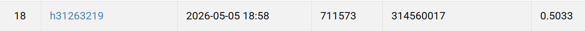

# NYCU Computer Vision 2026 HW3

- **Student ID:** 314560017
- **Name:** 陳沛妤

## Introduction

This repository tackles **Homework 3 — Cell Instance Segmentation** of
the NYCU 2026 Spring Visual Recognition course. We segment four cell
classes (`class1`–`class4`) on coloured medical images and submit the
results to CodaBench, where evaluation is by **AP@0.5** on segmentation
masks.

The model is **Mask R-CNN** (He *et al.*, ICCV 2017) with a ResNet-50 +
FPN backbone, customised to handle the small, dense cell instances that
dominate this dataset:

1. **Custom anchor scales** (8/16/32/64/128 px) instead of the default
   (32/64/128/256/512 px) — empirically motivated by the GT-instance
   size distribution (median √area ≈ 23 px, see report §4.1).
2. **Higher-resolution mask predictor** (rebuilt 4-conv head producing
   56×56 masks) for sharper boundaries on tightly packed cells.
3. **Two-LR-group AdamW** schedule with linear warm-up, mixed-precision
   training, gradient clipping, and a 90/10 train/val split (seed 42).

Total trainable parameters: **43.94 M** — well under the 200 M cap
(see [output/model_size.png](output/model_size.png)).

## Environment Setup

### Prerequisites
- Python 3.10 (Miniconda / Anaconda)
- CUDA-compatible GPU

### Installation (Miniconda)

```bash
# 1. Create the environment
conda create -n hw3 python=3.10 -y
conda activate hw3

# 2. Install PyTorch + CUDA (pick the build that matches your CUDA)
conda install pytorch torchvision pytorch-cuda=12.1 \
    -c pytorch -c nvidia -y

# 3. Install the remaining Python dependencies
pip install -r requirements.txt
```

`requirements.txt`: torch ≥ 2.0, torchvision ≥ 0.15, pycocotools,
scikit-image, imagecodecs, NumPy, Pillow, matplotlib, tqdm.

## Dataset Layout

Place the official `hw3-data-release` archive at the project root:

```
hw3-data-release/
├── train/
│   └── <image_uuid>/
│       ├── image.tif
│       ├── class1.tif    # optional, instance label-map
│       ├── class2.tif
│       ├── class3.tif
│       └── class4.tif
├── test_release/
│   └── <image_uuid>.tif
└── test_image_name_to_ids.json
```

Each per-class TIFF is a single-channel label map: every distinct
non-zero pixel value denotes one instance (background = 0).

## Usage

### Training

```bash
python train.py \
    --data_dir ./hw3-data-release \
    --output_dir ./output \
    --epochs 40 \
    --batch_size 1 \
    --lr 2e-4 \
    --lr_backbone 2e-5 \
    --backbone resnet50 \
    --eval_interval 2
```

| Argument | Default | Description |
|---|---|---|
| `--data_dir` | `./hw3-data-release` | Path to dataset root |
| `--epochs` | `40` | Number of training epochs |
| `--batch_size` | `1` | Native-resolution training |
| `--lr` | `2e-4` | LR for detection / mask heads |
| `--lr_backbone` | `2e-5` | LR for the ResNet backbone |
| `--backbone` | `resnet50` | `resnet50` or `resnet101` |
| `--val_ratio` | `0.1` | Validation hold-out fraction |
| `--eval_interval` | `2` | COCO eval every N epochs |
| `--no_amp` | flag | Disable mixed precision |
| `--resume` | _empty_ | Resume from checkpoint |

The best checkpoint by validation AP50 is saved as
`output/best_ap50_model.pth`; the most recent state goes to
`output/last_model.pth`; per-epoch metrics are dumped to
`output/history.json`.

### Inference

```bash
python inference.py \
    --data_dir ./hw3-data-release \
    --checkpoint ./output/best_ap50_model.pth \
    --output_dir ./output \
    --score_threshold 0.05
```

Produces `output/test-results.json` (COCO format with RLE
segmentations) and packages it into `output/submission.zip` ready for
CodaBench upload.

### Visualisations

```bash
# 1. Training loss + validation AP / AP50 over epochs
python visualize.py curves \
    --history ./output/history.json \
    --out ./output/training_curves.png

# 2. Per-class confusion matrix on the validation split
python visualize.py confmat \
    --data_dir ./hw3-data-release \
    --checkpoint ./output/best_ap50_model.pth \
    --out ./output/confusion_matrix.png

# 3. Predicted-vs-GT mask overlays on validation images
python visualize_predictions.py \
    --data_dir ./hw3-data-release \
    --checkpoint ./output/best_ap50_model.pth \
    --num_images 4 \
    --out ./output/qualitative.png

# 4. Trainable-parameter breakdown (shows < 200 M cap)
python model_size.py --out ./output/model_size.png

# 5. Additional experiments (anchor distribution, score sweep, imbalance)
python experiments.py --exps anchor score imbalance
```

## Project Structure

```
.
├── train.py                  # Training pipeline (AdamW + warm-up + AMP)
├── inference.py              # Inference and submission generation
├── model.py                  # Mask R-CNN builder (anchors, mask head)
├── dataset.py                # Dataset, augmentations, COCO-style targets
├── utils.py                  # RLE encoding, COCOEval helpers, meters
├── visualize.py              # Training curves + confusion matrix
├── visualize_predictions.py  # Qualitative prediction overlays
├── model_size.py             # Trainable-parameter audit
├── experiments.py            # Additional experiments (E1/E2/E3)
├── requirements.txt
├── README.md
└── output/                   # Checkpoints, history.json, figures, predictions
```

## Performance Snapshot

| Metric | Value |
|---|---|
| **Public Leaderboard AP50** | **0.5033** |
| Best Validation AP50 | 0.5142 (epoch 11) |
| Best Validation AP | 0.3199 (epoch 27) |
| Best Validation AP75 | 0.3822 (epoch 31) |
| Trainable Parameters | **43.94 M** (≪ 200 M cap) |
| Training Hardware | single CUDA GPU, AMP enabled |
| Total Training Run | 32 epochs (early-stopped) |

### Leaderboard Screenshot


